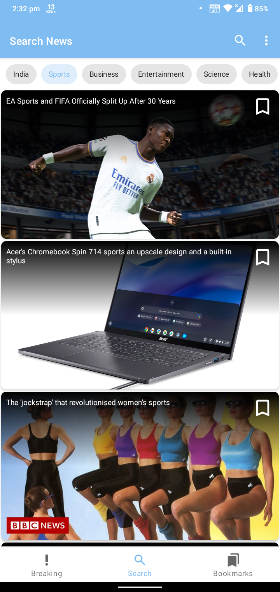
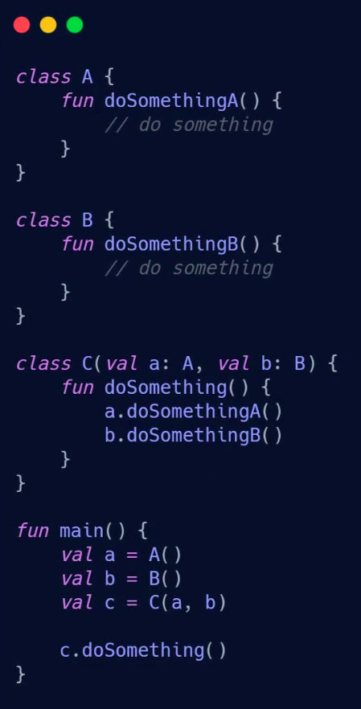

# Daily News:

  
   
   
   
   

- Build app using Google's best practices and recommended architecture for building robust, high-quality apps.

- It's a News App, which `fetches` news from a `REST API` and renders in a RecyclerView, not every time we are fetching from Internet instead we are `caching` it offline in the `Room Database`.

- For refreshing the manually using SwipeRefresh functionality, it also refreshes news articles time to time in around 60 minutes.

- Using WebView to open the detailed articles, rather than passing to other browser the intent.

- Breaking News `pageSize=100`.

- There also a `Search News` tab where we can search news using a keyword. For e.g. `topics, locations & sources` in a `PaginatedView` of pageSize=20 after user reached the last, then the another page is loaded.

- We can `Bookmarks` any news article which will appear in Bookmarks tab, these bookmarks are synchronized between all the screens, because of we are following `Single Source of truth principle`.

- App written in 100% kotlin.

- Using `Retrofit` to load data from `REST API`.

- `Caching` the data in `SQLite` Database using `Room persistance library`.

- For Paging, using the `Paging 3` library.

- For rendering images, `Glide` library.

- For multi-threading and long running operation, using Kotlin `Coroutines` & Kotlin `Flow`.

- For dependency injection using `Dagger Hilt`.

- In simple example dependency injection looks like.

  
   

- To access view in compile-time safe ways, using `ViewBinding`.